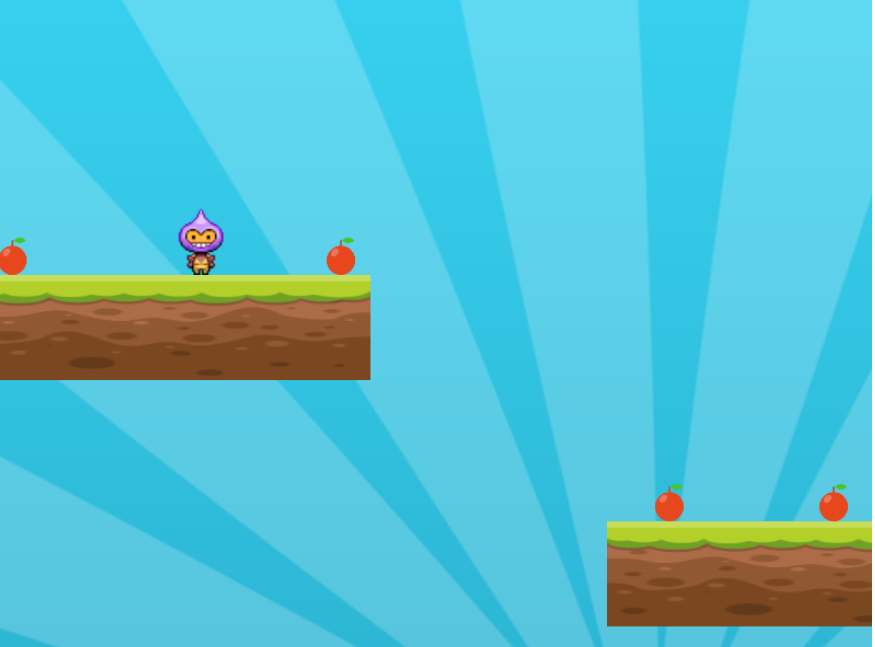
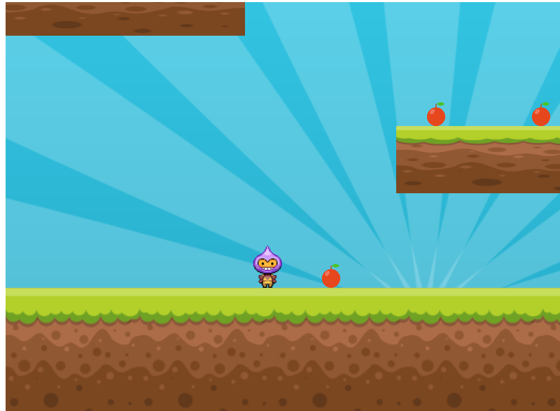
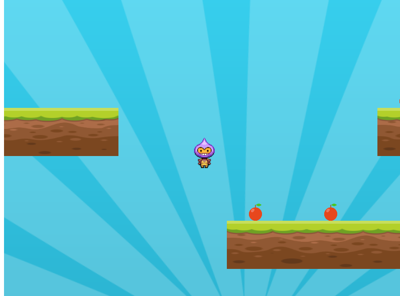
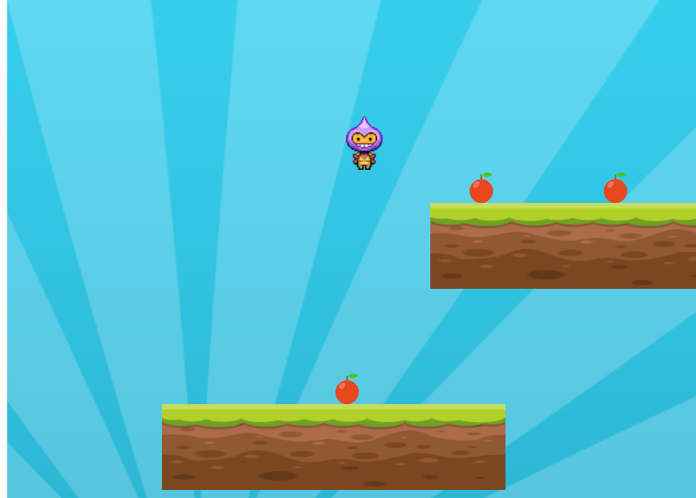
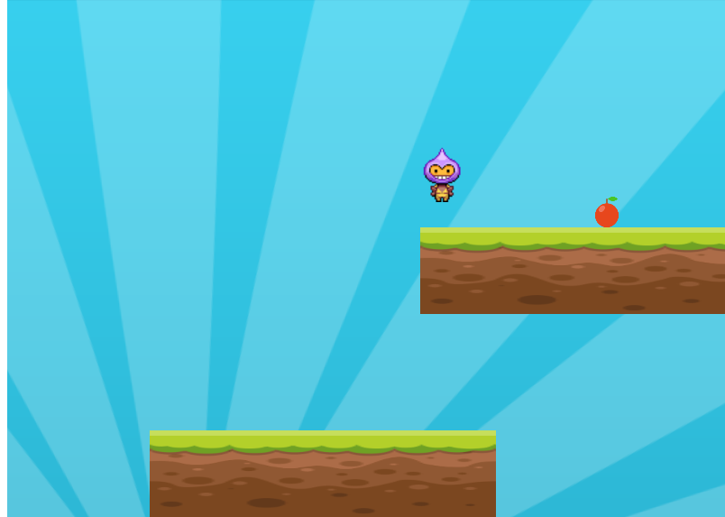

# Mario-Platformer
In this i have build a interactive platform for a game like mario using Phaser

### Game Preview
###You can move left , right .

  

###You can jump up .

  

###You can eat apple.

  

  

  

